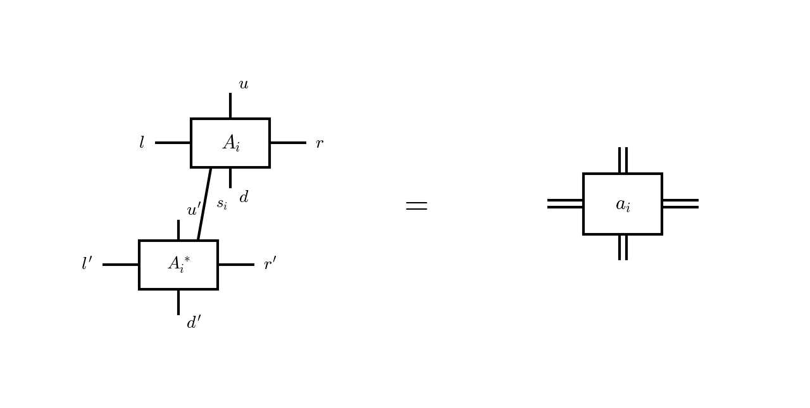

Methods
=======

This section describes the theoretical background of the algorithms implemented in Ace-TN.
We follow the notation established in [Richards2025]_. For a comprehensive review of tensor
network methods see [Orus2014]_, [Cirac2021]_.

iPEPS Ansatz
------------

The infinite projected entangled-pair state (iPEPS) ansatz approximates an infinite
two-dimensional quantum many-body state through a periodic tensor network [Verstraete2004]_,
[Jordan2008]_. Each site :math:`i` of the square lattice is associated with a rank-5 site
tensor :math:`A^{[s_i]}_{l_i u_i r_i d_i}` carrying a physical index :math:`s_i` of dimension
:math:`d` and four bond indices :math:`l_i, u_i, r_i, d_i` each of dimension :math:`D`:

.. image:: png/site_tensor.png
   :align: center
   :width: 300px

The bond dimension :math:`D` controls the amount of entanglement captured by the ansatz,
with :math:`D = 1` corresponding to a product state. Increasing :math:`D` systematically
improves the approximation.

Double-Layer Tensor
-------------------

Expectation values require contracting the tensor-network state with its conjugate, forming
a double-layer tensor network. The double-layer tensor at site :math:`i` is obtained by
contracting :math:`A_i` with :math:`A^\dagger_i` over the physical index and fusing pairs of
bond indices:

.. math::

   a_{(l_i l'_i)(u_i u'_i)(r_i r'_i)(d_i d'_i)}
   = \sum_{s_i} A^{[s_i]}_{l_i u_i r_i d_i} \, A^{[s_i]\dagger}_{l'_i u'_i r'_i d'_i}

Diagrammatically, the ket and bra layers are contracted over the physical index :math:`s_i`
and each pair of bond indices is fused into a single leg of dimension :math:`D^2`:

Boundary Tensor Approximation
-----------------------------

The infinite double-layer network cannot be contracted exactly. It is approximated by boundary
tensors surrounding each site: corner transfer matrices :math:`C^k_i` (rank-2) and edge
tensors :math:`E^k_i` (rank-3) for :math:`k = 1,2,3,4` [Nishino1996]_, [Orus2009]_. The
environment of a site is then approximated by the finite arrangement:

.. image:: png/boundary_environment.png
   :align: center
   :width: 400px

Here :math:`C^k` are rank-2 corner tensors and :math:`E^k` are rank-3 edge tensors. Each
corner carries two boundary bonds of dimension :math:`\chi`, and each edge carries two
boundary bonds and one double-layer bond. The boundary tensors encode the effect of the
infinite lattice surrounding each site. Their computation is the task of the CTMRG algorithm.

.. toctree::
   :maxdepth: 2

   ctmrg
   full_update
   simple_update

References
----------

.. [Verstraete2004] F. Verstraete and J. I. Cirac, *Renormalization algorithms for quantum-many body systems in two and higher dimensions*, arXiv:cond-mat/0407066 (2004).

.. [Jordan2008] J. Jordan, R. Orús, G. Vidal, F. Verstraete, and J. I. Cirac, *Classical simulation of infinite-size quantum lattice systems in two spatial dimensions*, Phys. Rev. Lett. **101**, 250602 (2008).

.. [Nishino1996] T. Nishino and K. Okunishi, *Corner transfer matrix renormalization group method*, J. Phys. Soc. Jpn. **65**, 891 (1996).

.. [Orus2009] R. Orús and G. Vidal, *Simulation of two-dimensional quantum systems on an infinite lattice revisited: Corner transfer matrix for tensor contraction*, Phys. Rev. B **80**, 094403 (2009).

.. [Orus2014] R. Orús, *A practical introduction to tensor networks: Matrix product states and projected entangled pair states*, Annals of Physics **349**, 117 (2014).

.. [Cirac2021] J. I. Cirac, D. Pérez-García, N. Schuch, and F. Verstraete, *Matrix product states and projected entangled pair states: Concepts, symmetries, theorems*, Rev. Mod. Phys. **93**, 045003 (2021).

.. [Richards2025] A. D. S. Richards and E. S. Sørensen, *Ace-TN: GPU-Accelerated Corner-Transfer-Matrix Renormalization of Infinite Projected Entangled-Pair States*, arXiv:2503.13900 (2025).
